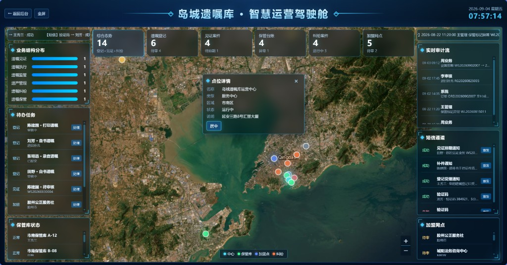
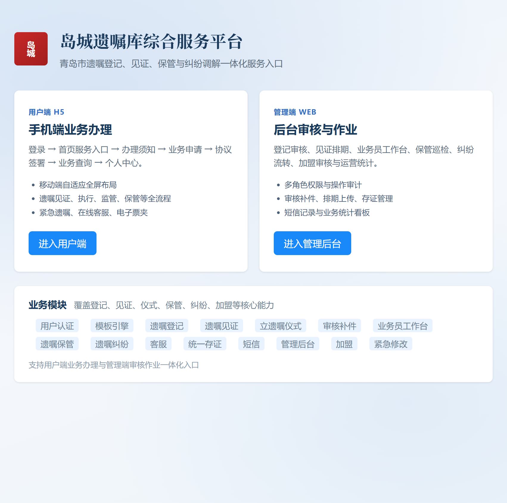
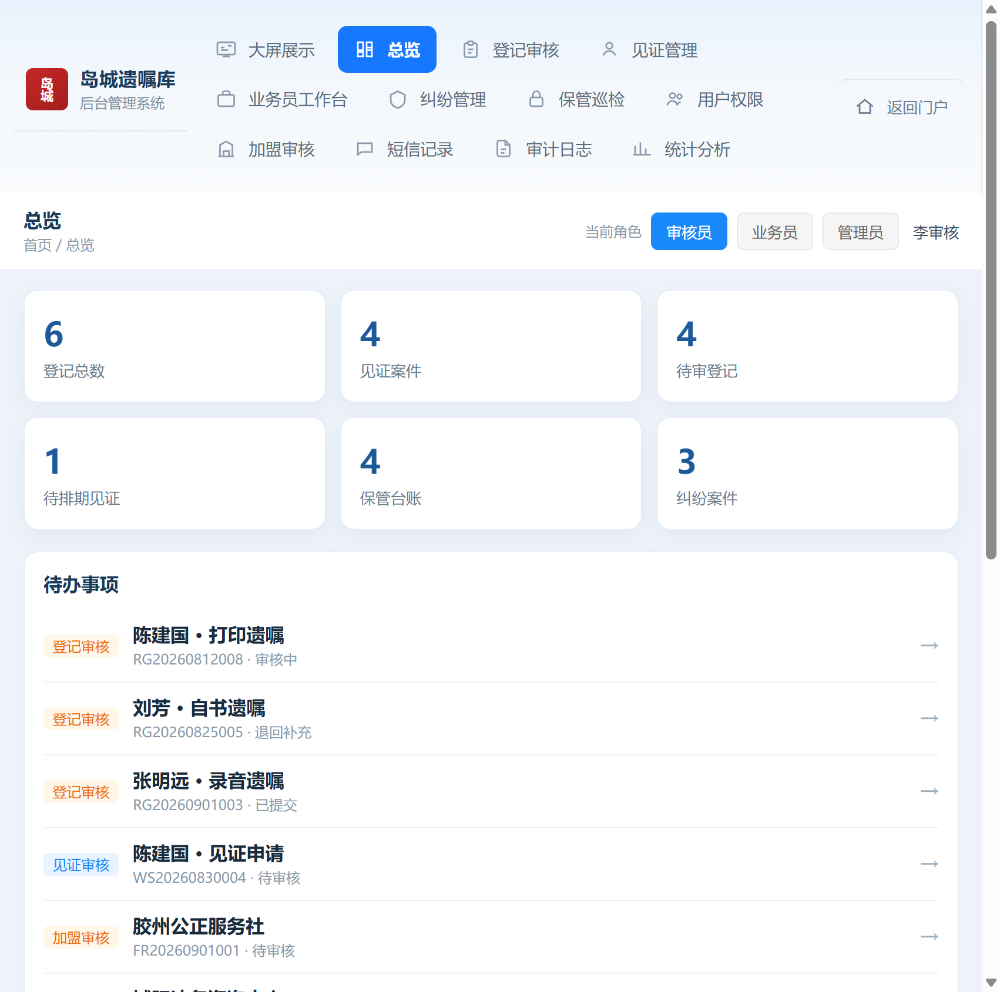
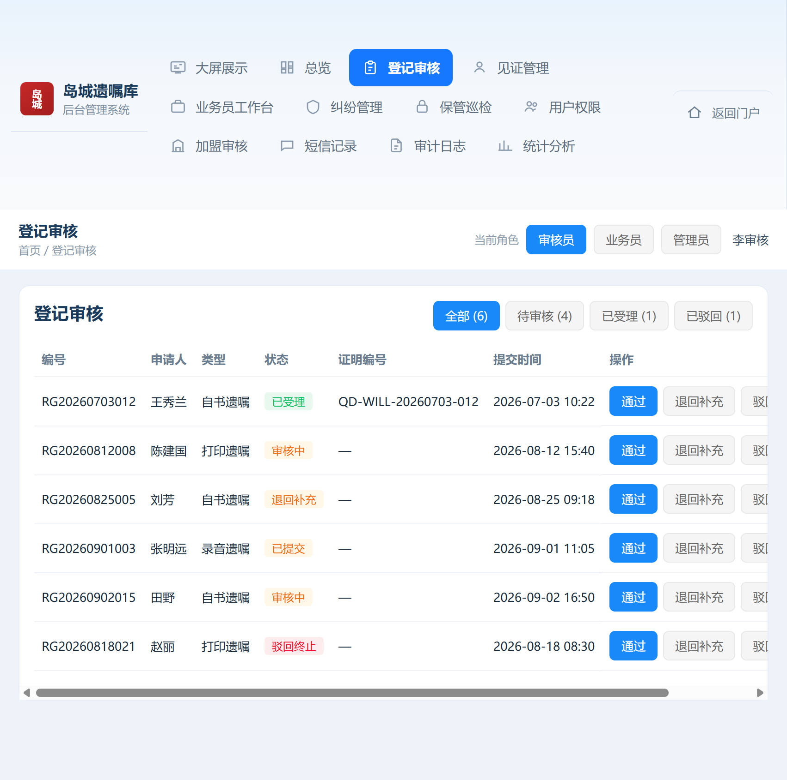
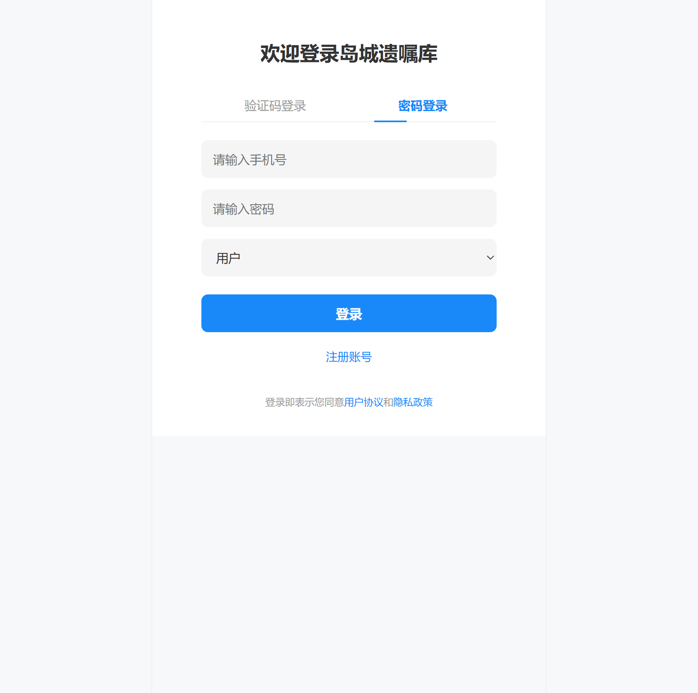
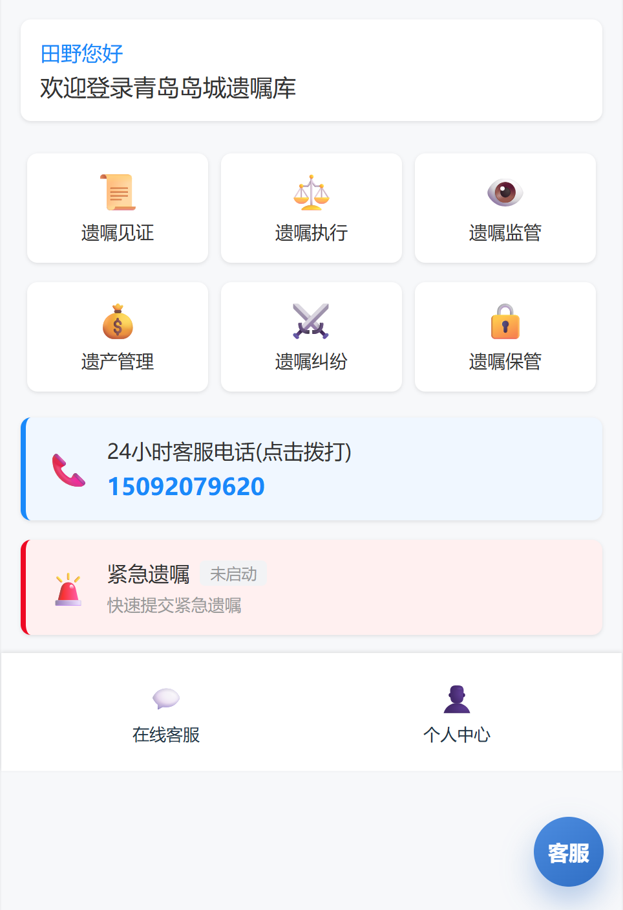

# 岛城遗嘱库综合服务平台

> 青岛市遗嘱登记、见证、保管、执行、监管与纠纷调解一体化服务系统  
> **Testamentary Will Repository** · Vue 3 + Vite

本项目面向「遗嘱库」业务场景，提供完整的三端入口：

| 端 | 说明 | 入口 |
| --- | --- | --- |
| **门户** | PC 统一入口，分流到用户端 / 管理端 | `/#/` |
| **用户端 H5** | 移动端全流程业务办理 | `/#/h5/login` |
| **管理后台** | 审核、排期、巡检、加盟与统计 | `/#/admin` |
| **智慧大屏** | 科技风运营驾驶舱 + 青岛业务一张图 | `/#/admin/screen` |
| **后端 API** | NestJS + PostgreSQL（对齐上述页面） | `http://127.0.0.1:3000/api` |

后端说明与库表 / API 文档见 [`docs/backend/`](docs/backend/README.md)，工程目录 [`backend/`](backend/README.md)。

---

## 目录

- [效果预览](#效果预览)
- [系统架构](#系统架构)
- [技术栈](#技术栈)
- [快速开始](#快速开始)
- [门户页](#门户页)
- [智慧运营大屏](#智慧运营大屏)
- [管理后台功能介绍](#管理后台功能介绍)
- [H5 用户端功能介绍](#h5-用户端功能介绍)
- [路由一览](#路由一览)
- [目录结构](#目录结构)
- [本地数据与持久化](#本地数据与持久化)
- [天地图密钥（大屏可选）](#天地图密钥大屏可选)
- [构建与预览](#构建与预览)
- [说明与边界](#说明与边界)
- [后端与数据库](#后端与数据库)

---

## 效果预览

### 1. 智慧运营驾驶舱（大屏）

全幅青岛卫星地图为底，KPI、待办、审计流、短信通道、加盟网点等半透明毛玻璃面板叠放其上；支持点位交互、矢量/卫星切换与全屏展示。



### 2. 综合服务门户

PC 门户一屏分流：左侧进入用户端 H5，右侧进入管理后台；底部展示业务能力标签。



### 3. 管理后台 · 总览

登记/见证/待办/保管/纠纷等核心指标卡片、待办列表与最近审计，支持角色切换（审核员 / 业务员 / 管理员）。



### 4. 管理后台 · 登记审核

按状态筛选登记单，支持通过、退回补充、驳回与详情抽屉，操作写入审计日志。



### 5. 用户端 H5 · 登录

验证码 / 密码双模式登录，身份可选用户、加盟人、管理员、合作伙伴；表单为空，不预填任何账号信息。



### 6. 用户端 H5 · 首页

六大业务入口（见证 / 执行 / 监管 / 遗产管理 / 纠纷 / 保管），以及紧急遗嘱、客服电话、在线客服与个人中心。



---

## 系统架构

```text
                    ┌─────────────────────────┐
                    │   门户 Portal  /#/      │
                    └───────────┬─────────────┘
              ┌─────────────────┴─────────────────┐
              ▼                                   ▼
   ┌────────────────────┐              ┌────────────────────┐
   │  用户端 H5         │              │  管理端 WEB        │
   │  /#/h5/*           │◄──共享状态──►│  /#/admin/*        │
   │  业务申请 / 协议   │  store.js    │  审核 / 排期 / 统计│
   └────────────────────┘  localStorage└─────────┬──────────┘
                                                 │
                                                 ▼
                                    ┌────────────────────┐
                                    │ 智慧运营驾驶舱      │
                                    │ /#/admin/screen    │
                                    │ 天地图 · 一张图    │
                                    └────────────────────┘
```

- **路由模式**：Vue Router **Hash**（`/#/...`），便于静态托管与本地双击预览。
- **状态中心**：`src/store.js` 聚合业务实体；变更经 `persist()` 写入浏览器。
- **种子数据**：`src/seed.js` 提供登记、见证、纠纷、保管、加盟、短信、审计等初始样本。

---

## 技术栈

| 类别 | 选型 |
| --- | --- |
| 框架 | Vue 3（Composition API + `<script setup>`） |
| 构建 | Vite 6 |
| 路由 | Vue Router 4（Hash History） |
| 样式 | 原生 CSS + 设计 Token（`src/styles/tokens.css`） |
| 地图 | 天地图 JS API（大屏可选，需自行申请 Web 服务密钥） |
| 存储 | `localStorage`（键名 `will-demo-state-v5`） |

无后端、无数据库、无第三方登录依赖；安装依赖后即可本地运行。

---

## 快速开始

### 环境要求

- Node.js **18+**（建议 LTS）
- npm 9+（或兼容的包管理器）

### 安装与启动

```bash
# 进入项目目录
cd will-demo

# 安装依赖
npm install

# 启动开发服务（绑定 127.0.0.1:5173）
npm run dev
```

浏览器访问：

- 门户：[http://127.0.0.1:5173/#/](http://127.0.0.1:5173/#/)
- 用户端登录：[http://127.0.0.1:5173/#/h5/login](http://127.0.0.1:5173/#/h5/login)
- 管理后台：[http://127.0.0.1:5173/#/admin](http://127.0.0.1:5173/#/admin)
- 智慧大屏：[http://127.0.0.1:5173/#/admin/screen](http://127.0.0.1:5173/#/admin/screen)

亦可用 `npm start`（严格端口 `5173`，与 `dev` 类似）。

### 登录说明

本仓库**不提供、不预填任何固定手机号或密码**。

- H5：输入任意合法大陆手机号（`1` 开头 11 位）及任意非空密码（或 4–6 位验证码）即可进入用户端。
- 登录身份选择「管理员」时，将直接跳转管理后台。
- 后台顶部可切换角色视角（审核员 / 业务员 / 管理员），便于查看不同权限下的作业视图。

---

## 门户页

路径：`/#/` · 组件：`src/views/Portal.vue`

门户是系统的「总前台」，采用轻量品牌页布局：

1. **用户端 H5** — 面向市民 / 立遗嘱人 / 加盟方，强调移动端全流程办理。
2. **管理端 WEB** — 面向审核员、业务员与管理员，强调审核作业与运营统计。
3. **业务模块标签** — 用户认证、模板、登记、见证、仪式、补件、工作台、保管、纠纷、客服、存证、短信、加盟、紧急修改等能力索引。

适合作为系统总入口与对外介绍页。

---

## 智慧运营大屏

路径：`/#/admin/screen` · 组件：`src/views/admin/BigScreen.vue`

大屏定位为「岛城遗嘱库 · 智慧运营驾驶舱」，视觉上采用深蓝科技风 + 毛玻璃浮层，地图贯穿全屏：

### 布局结构

| 区域 | 内容 |
| --- | --- |
| 顶栏 | 返回后台、全屏、标题、实时时钟 |
| 顶部 KPI | 综合态势、遗嘱登记、见证案件、保管台账、纠纷案件、加盟网点（可筛选高亮） |
| 左侧栏 | 业务结构分布、待办任务、保管库状态 |
| 中央 | 青岛业务一张图（矢量 / 卫星），点位图例与详情浮层 |
| 右侧栏 | 实时审计流、短信通道、加盟网点列表 |
| 滚动条 | 运营动态跑马灯 |

### 地图与交互

- 默认卫星影像，可切换矢量底图；支持「定位青岛」、缩放控件。
- 点位类型：**中心 / 保管库 / 加盟点 / 纠纷**。
- 点击点位打开详情：名称、类型、区域、状态、说明；可居中定位。
- 部分点位支持快捷作业（如保管异常恢复、加盟通过入库、纠纷阶段推进）。
- 未配置天地图密钥时仍可使用交互骨架；配置后加载真实青岛底图（见下文「天地图密钥」）。

### 适用场景

展厅投屏、领导驾驶舱、运维值班大屏、对外产品展示。可从后台侧栏「大屏展示」一键进入。

---

## 管理后台功能介绍

路径前缀：`/#/admin` · 壳层：`src/views/admin/AdminShell.vue`

浅色侧栏（或宽屏顶栏导航）+ 内容区；顶栏提供**当前角色**切换与面包屑。各模块共用同一套本地状态，操作会刷新列表并写入审计。

### 模块一览

| 菜单 | 路径 | 功能要点 |
| --- | --- | --- |
| **大屏展示** | `/admin/screen` | 跳转智慧运营驾驶舱（见上节） |
| **总览** | `/admin` | KPI 卡片、待办聚合、业务结构概览、最近审计 |
| **登记审核** | `/admin/review` | 遗嘱登记单筛选；通过 / 退回补充 / 驳回；详情抽屉；生成证明编号 |
| **见证管理** | `/admin/witness` | 见证案件列表与状态跟踪 |
| **业务员工作台** | `/admin/workbench` | 排期、材料上传、现场作业相关待办 |
| **纠纷管理** | `/admin/dispute` | 纠纷案件阶段流转与结案 |
| **保管巡检** | `/admin/custody` | 保管库台账、异常巡检与状态维护 |
| **用户权限** | `/admin/users` | 后台账号、角色与启用状态管理 |
| **加盟审核** | `/admin/franchise` | 加盟网点申请审核 / 入库 / 驳回 |
| **短信记录** | `/admin/sms` | 通知类短信发送记录与重发 |
| **审计日志** | `/admin/audit` | 关键操作流水（谁、何时、做了什么） |
| **统计分析** | `/admin/stats` | 业务量与结构统计看板 |

### 登记审核（核心作业流）

1. 用户端提交登记 / 见证类申请后，出现在「登记审核」或相关待办。
2. 审核员按状态 Tab（全部 / 待审核 / 已受理 / 已驳回）筛选。
3. **通过**：更新状态并写入证明编号；**退回补充**：要求用户补件；**驳回**：终止流程。
4. 每次关键动作写入「审计日志」，并反映到大屏「实时审计流」。

### 角色视角

| 角色 | 典型关注点 |
| --- | --- |
| 审核员 | 登记审核、补件、驳回 |
| 业务员 | 工作台排期、现场见证协同 |
| 管理员 | 用户权限、加盟、统计与全局审计 |

---

## H5 用户端功能介绍

路径前缀：`/#/h5` · 壳层：`src/views/h5/H5Shell.vue`

移动端优先：内容区最大宽度约 480px 居中全屏，无旁侧说明框，适合真机与窄屏访问。

### 主流程

```text
登录 / 注册
  → 首页六宫格选业务
  → 办理须知（通知阅读）
  → 业务申请（材料 / 信息填写）
  → 协议签署
  → 业务列表查询
  → 个人中心
```

### 首页六大业务

| 业务 | 说明 |
| --- | --- |
| 遗嘱见证 | 选择见证类型、材料与见证人/机构，进入协议与后续流程 |
| 遗嘱执行 | 执行人相关协议与业务办理 |
| 遗嘱监管 | 监管服务协议与进度查询 |
| 遗产管理 | 遗产管理服务入口 |
| 遗嘱纠纷 | 纠纷调解意向与材料提交 |
| 遗嘱保管 | 保管协议、存证与保管状态 |

### 登录与账号

- **验证码登录** / **密码登录** 双 Tab。
- 身份：用户、加盟人、管理员、合作伙伴。
- **注册**：手机号校验 → 设置资料与密码 → 进入系统。
- 不在界面与文档中暴露任何固定账号。

### 首页附加能力

- **24 小时客服电话**：一键 `tel:` 拨打（业务咨询电话，非登录口令）。
- **紧急遗嘱**：快速多文件上传（图 / PDF / 视频等），状态徽章展示是否已启动。
- **在线客服**：浮动入口与聊天页，带业务上下文。
- **个人中心**：在办 / 已办业务、订单、个人信息、见证人、协议、电子票夹、AI 帮助、紧急修改记录等。

### 个人中心菜单

| 菜单项 | 能力 |
| --- | --- |
| 在办(申请)业务 | 进行中的业务列表与状态 |
| 已办业务 | 已完成归档查询 |
| 我的订单 | 订单与费用相关记录 |
| 修改遗嘱记录 | 紧急/变更类记录入口 |
| 个人信息 | 姓名、手机号等资料维护 |
| 紧急修改遗嘱记录 | 口头修改 / 视频存证历史 |
| 聊天消息 | 客服会话 |
| 电子票夹 | 票据与凭证集中存放 |
| AI 帮助 | 业务流程问答说明 |
| 我的见证人等 | 个人/机构服务方管理 |
| 我的协议 | 已签署协议列表 |

### 其他重要页面

- **办理须知 / 通知阅读**：进入正式申请前的告知确认。
- **业务申请（BusinessBuild）**：分类型表单、手机验证、材料上传。
- **见证协议 / 各类服务协议**：阅读确认后生成业务与订单。
- **立遗嘱仪式（Ceremony）**：多方在线核验与仪式状态流转。
- **加盟申请**：网点/律所等合作方提交加盟意向。
- **纠纷 / 保管** 专项页：与后台纠纷、保管模块数据联动。

---

## 路由一览

### 门户与后台

| 路径 | 说明 |
| --- | --- |
| `/#/` | 综合服务门户 |
| `/#/admin` | 后台总览 |
| `/#/admin/screen` | 智慧运营大屏 |
| `/#/admin/review` | 登记审核 |
| `/#/admin/witness` | 见证管理 |
| `/#/admin/workbench` | 业务员工作台 |
| `/#/admin/dispute` | 纠纷管理 |
| `/#/admin/custody` | 保管巡检 |
| `/#/admin/users` | 用户权限 |
| `/#/admin/franchise` | 加盟审核 |
| `/#/admin/sms` | 短信记录 |
| `/#/admin/audit` | 审计日志 |
| `/#/admin/stats` | 统计分析 |

### 用户端 H5（节选）

| 路径 | 说明 |
| --- | --- |
| `/#/h5/login` | 登录 |
| `/#/h5/register` | 注册 |
| `/#/h5` | 首页 |
| `/#/h5/business-build/:type` | 业务申请 |
| `/#/h5/business-list/:code` | 业务列表 |
| `/#/h5/witness-agreement` 等 | 各类协议 |
| `/#/h5/menu` | 个人中心 |
| `/#/h5/profile` | 个人信息 |
| `/#/h5/orders` | 我的订单 |
| `/#/h5/emergency` | 紧急遗嘱相关 |
| `/#/h5/chat` | 在线客服 |
| `/#/h5/providers` | 我的见证人等 |
| `/#/h5/my-agreements` | 我的协议 |

完整定义见 `src/router/index.js`。

---

## 目录结构

```text
will-demo/
├── backend/              # NestJS + Prisma + PostgreSQL API
├── docs/
│   ├── backend/          # 后端架构 / 库表 / API / 联调文档
│   └── images/           # README 配图
├── public/               # 静态资源
├── src/
│   ├── components/       # SealLogo、客服浮层等
│   ├── router/           # 路由表
│   ├── styles/           # 全局样式与 Token
│   ├── views/
│   │   ├── Portal.vue    # 门户
│   │   ├── admin/        # 后台 + 大屏
│   │   └── h5/           # 用户端页面
│   ├── seed.js           # 前端本地初始样本
│   ├── store.js          # 前端状态（联调前 localStorage）
│   ├── App.vue
│   └── main.js
├── index.html
├── package.json
├── vite.config.js
└── README.md
```

---

## 后端与数据库

工程位置：[`backend/`](backend/README.md)  
文档索引：[`docs/backend/`](docs/backend/README.md)

```bash
cd backend
docker compose up -d postgres
npm install
npx prisma migrate dev --name init
npm run prisma:seed
npm run start:dev
```

API 默认：`http://127.0.0.1:3000`（健康检查 `/api/health`）。

---

## 本地数据与持久化

| 项 | 说明 |
| --- | --- |
| 存储键 | `will-demo-state-v5` |
| 内容 | 登录态、用户资料、登记/见证/纠纷/保管/加盟/短信/审计等列表 |
| 重置方式 | 浏览器开发者工具 → Application → Local Storage → 删除该键后刷新 |

前后台、大屏共用同一数据源：H5 提交的申请会出现在后台审核与大屏待办；后台审核结果也会反映到用户业务列表状态。

---

## 天地图密钥（大屏可选）

大屏地图使用[天地图](https://www.tianditu.gov.cn/) Web 服务。

1. 打开 [天地图控制台](https://console.tianditu.gov.cn/) 申请浏览器端 `tk`。
2. 进入大屏，点击工具栏「密钥」，粘贴后「应用密钥」。
3. 密钥保存在浏览器 `localStorage`（键名 `will-demo-tdt-tk`），不会提交到仓库。

未配置密钥时，大屏其余 KPI、待办与侧栏模块仍可完整使用。

---

## 构建与预览

```bash
# 生产构建 → dist/
npm run build

# 本地预览构建产物（127.0.0.1:4173）
npm run preview
```

可将 `dist/` 部署到任意静态站点（Nginx、GitHub Pages、对象存储静态网站等）。因使用 Hash 路由，一般无需额外 rewrite 规则。

---

## 说明与边界

- 业务规则与文案围绕「青岛岛城遗嘱库」场景设计，**不构成法律意见或正式业务系统**。
- 前端验证码、短信、人脸核验、支付等在未联调前可为本地模拟；后端已提供对应 API 与开发种子账号（见 `docs/backend/02-database.md`）。
- 截图见 `docs/images/`，可随版本更新替换。

---

## License

按需二次开发。Issue 欢迎通过 GitHub 仓库提交。
